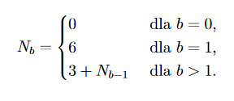

# Programowanie proceduralne

## Laboratorium 2

## Zadania

1.  ( 1 ) Napisz program, który alokuje pamięć korzystając z funkcji **`malloc` **dla jednowymiarowej tablicy zmiennych rzeczywistych o rozmiarze podanym przez użytkownika, wypełnia ją liczbami pseudolosowymi z przedziału od 230 do 341\. Nie używaj operatora nawiasowego, do wypisania wartości tablicy na ekran użyj zmiennej **`float *iter`**

4.  ( 2 ) Proszę napisać funkcję, która przyjmuje jako parametry 2 wskaźniki na liczby rzeczywiste i oblicza podłogę z iloczynu wartości, na które wskazują te wskaźniki. Funkcja ma zwrócić wskaźnik na zmienną całkowitą przechowującą tak otrzymaną wartość.

7.  Proszę napisać program, w którym :
    *   utworzone zostaną dwie tablice liczb rzeczywistych 10 i 15 elementową, o wartościach z przedziału <1.0, 2.0>
    *   ( 3 ) napisana zostanie procedura sortująca rosnąco tablicę jednowymiarową metodą prostego wybierania **`void sort(float *, int);`**
    *   ( 1 ) utworzone tablice zostaną posortowane

    *   ( 3 ) napisana zostanie funkcję **`float* one_two(float * , int, float * , int, int*);`**, która otrzyma jako argumenty dwie tablice posortowane liczb rzeczywistych i utworzy nową tablicę, której wartości będą pochodziły z przekazanych tablic, nie będą się powtarzały i będą posortowane rosnąco.

    _Przykład :

    <pre>
    Posortowane tablice argumenty funkcji:
          arg_1 - {1.0, 1.2, 1.2, 1.5, 1.5, 1.5, 1.6, 1.6, 1.8, 1.9}
          arg_2 - {1.0, 1.1, 1.1, 1.2, 1.4, 1.5, 1.6, 1.6, 1.8, 1.8, 1.8, 1.9, 1.9, 2.0, 2.0}

    Wynik
          tablica - {1.0, 1.1, 1.2, 1.4, 1.5, 1.6, 1.8, 1.9, 2.0}
    	</pre>

    _
    ( 2 )

    **`one_two` **

10.  ( 3 ) Proszę zaimplementować funkcję rekurencyjną:
    
