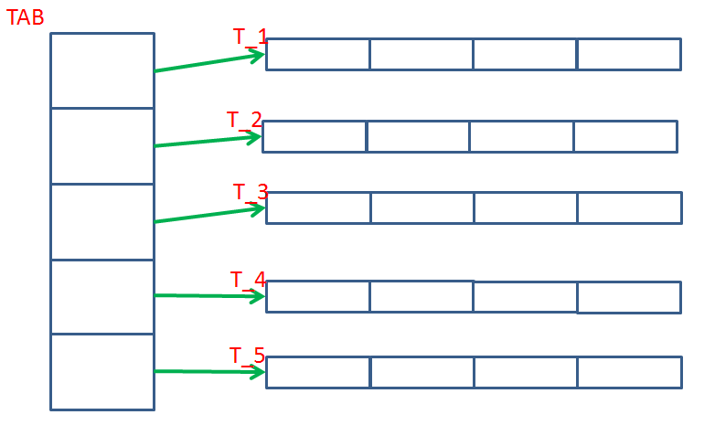

# Programowanie proceduralne

## Laboratorium 3

## Zadania

1.  ( 3 ) Proszę napisać program, który wypisze na ekran trójkąt Pascala o podanej przez użytkownika wysokości. W programie korzystamy z tablicy jednowymiarowej, która przechowuje tylko aktualnie wypisywany poziom. Na początku programu tablica przechowuje tylko jeden element: **`pas[0]=1`**. W każdej kolejnej iteracji zwiększamy rozmiar tablicy o jeden element, wykorzystaj funkcję **`realloc`**.
    Zawsze **`pas[0]=1`**oraz **`pas[ostatni element] = 1\.`**

    <pre> **1
         1 1
        1 2 1
      1  3 3  1
     1 4  6  4 1
    1 5 10 10 5 1**
    </pre>

3.  Proszę zadeklarować i wypełnić dowolnymi liczbami z zakresu (0, 10) pięć tablic czteroelementowych liczb zmiennoprzecinkowych **`T_1[4], T_2[4], T_3[4], T_4[4], T_5[4]`**

    1.  ( 2 ) Proszę utworzyć tablicę `**TAB[5]**` tak, aby możliwe było "podpięcie" tablic **`T_x`** pod kolejne elementy tablicy `**TAB**` zgodnie z rysunkiem:

        

    4.  ( 1 ) Proszę wypisać zawartość tablic

            for (i = 0; i<sizeof......./sizeof......; i++){
               for (j = 0; j<4; j++)
            	    printf("%.2f", TAB[...][...]);
               printf ("\n");
            }

    7.  ( 2 ) Proszę napisać funkcję liczącą sumę wartości liczb zapisanych w wybranej tablicy** `T_x`** - dostęp do tablicy ma być zrealizowany przy użyciu wskaźnika `**TAB**` . Wywoł anie funkcji powinno wyglądać następująco **`suma (TAB, numer_tablicy, dlugosc_tablicy)`**.

    10.  ( 3 ) Proszę napisać funkcję zwracającą wskaźnik do tablicy, która ma najmniejszą sumę elementów - należy skorzystać z funkji z poprzedniego punktu

    13.  ( 3 ) Wykorzystując funkcję z poprzedniego punktu proszę posortować rosnąco tablicę `**TAB**` względem sumy "podpiętej" tablicy.

6.  Metoda sito Eratostenesa służy do wykrywania liczb pierwszych. Pozwala znaleźć wszystkie liczby pierwsze mniejsze od zadanej wartości n. Polega to na utworzeniu listy liczb całkowitych od 1 do n i wykreślaniu liczb podzielnych przez inne.
    Algorytm:

    _*   Wykreśla się liczbę 1,*   Poszukuje się, poczynając od ostatniej znalezionej liczby pierwszej (za pierwszym razem od 1) najbliższej niewykreślonej liczby. Liczba ta jest pierwsza. Następnie wykreśla się z listy wszystkie liczby podzielne przez te liczby pierwsze*   powtarza się krok dwa aż do chwili, gdy znaleziona liczba pierwsza będzie większa od n1/2_

    ( 2 ) Wykorzystując powyższy algorytm, proszę napisać program który szuka liczb pierwszych mniejszych od podanej przez użytkownika wartości `**N**`.
    Wartość maksymalna `**N = 100000**`. Proszę wykonać zadanie na jednej tablicy.
