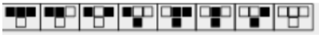

# Programowanie proceduralne

## Laboratorium 8

* * *

    void qsort(void * base,size_t num, size_t width,int( * compare )( const void *, const void * ));

*   **const void *base** - wskaźnik na tablicę, która ma zostać posortowana.
*   **size_t num** - liczba elementów w tablicy.
*   **size_t width** - liczba bajtów zajmowanych przez jeden element tablicy.
*   **int (*compare ) ( const void *, const void *)** - funkcja porównująa elementy tablicy. Do argumentów przedmiotowej funkcji trafiają wskaźniki na elementy obecnie porównywane.  
    Funkcja przekazana jako argument **compare** powinna zwracać następujące wartości:
    *   mniejsze od 0 - gdy wartość argumentu pierwszego jest mniejsza od argumentu drugiego;
    *   równe 0 - gdy wartośćargumentu pierwszego jest równa wartości argumentu drugiego;
    *   większe od 0 - gdy wartość argumentu pierwszego jest większa od argumentu drugiego.

* * *

    void *bsearch(const void *key, const void *base, size t nmemb, size t size, int (*compar)(const void *, const void *));

Funkcja zwraca wskaźnik na element tablicy **base**, pasujący do szukanego klucza **key**. Jeżeli klucz nie został znaleziony, funkcja zwraca wartość NULL. Jeżeli tablica nie jest posortowana rosnąco lub zawiera elementy posiadające zduplikowane klucze to wynik funkcji jest nieprzewidywalny.

*   **const void *key** - poszukiwany klucz.
*   **const void *base** - wskaźnik na posortowaną tablicę, która ma zostać przeszukana.
*   **size_t num** - liczba elementów w tablicy.
*   **size_t width** - liczba bajtów zajmowanych przez jeden element tablicy.
*   **int (*compare ) ( const void *, const void *)** - funkcja porównująca klucze. Do pierwszego argumentu przedmiotowej funkcji trafia wskaźnik na element poszukiwany key, natomiast do drugiego wskaźnik na element tablicy base z którym ma nastąpić porównanie..  
    Funkcja przekazana jako argument **compare** powinna zwracać następujące wartości:
    *   mniejsze od 0 - gdy wartość argumentu pierwszego jest mniejsza od argumentu drugiego;
    *   równe 0 - gdy wartośćargumentu pierwszego jest równa wartości argumentu drugiego;
    *   większe od 0 - gdy wartość argumentu pierwszego jest większa od argumentu drugiego.

* * *

## Zadania

1.  ( 4 ) Proszę utworzyć strukturę `**Klient**`, zawierającą pola: `**f_name**` i `**l_name** `do przechowywania imienia i nazwiska, pole `**code**` do przechowywania kodu pocztowego w rzeczywistym formacie oraz pole `**age**`.  
    Następnie,proszę utworzyć tablicę 5 elementową struktur i wypełnić danymi wczytanymi z pliku tekstowego <coe>**dane.txt** - proszę wcześniej je przygotować.  
    Tablicę proszę posortować według **nazwiska** (pierwszy klucz sortowania), a następnie według **imienia** (drugi klucz sortowania).

4.  ( 4 ) Proszę skonstruować strukturę `**liczba**`, która ma dwa pola: `**zmienną znakową**` oraz `**unię**`.  
    Unia ma dwa pola: `**zmienną całkowitą**` oraz `**zmienną rzeczywistą**` podwójnej precyzji.  
    Zmienna znakowa przyjmuje jedną z dwóch wartosci **'i'** lub **'d'** oznaczającą typ zmiennej przechowywanej w unii.  
    Zaalokuj tablicę 20 struktur typu `**liczba**`, z prawdopodobieństwem 1/2 wypełnij ją liczbami całkowitymi i rzeczywistymi.  
    Napisz funkcję, która wypisze elementy tablicy (wartość i typ). Zapisz tablicę do pliku binarnego. Sprawdź ile danych jest zapisanych w pliku binarnym i wczytaj je do odpowiednio dużej dynamicznej tablicy.

8.  ( 2 ) Proszę napisać <u>jedną funkcję sortującą</u>, która jednocześnie posortuje elementy całkowite niemalejąco, a elementy rzeczywiste nierosnąco. Jednocześnie przestawiając elementy całkowite do pierwszej połówki tablicy, a elementy rzeczywiste do drugiej połówki tablicy. Proszę przetestować działanie na tablicy z poprzedniego zadania.

11.  ( 2 ) [Do zadania 9-tego z poprzednich zajęć](vector.c) - utworzoną tablicę proszę posortować według długości wektora (` **qsort**`) i znaleźć wektor o wczytanej długości (` **bsearch**`).

14.  ( 6 ) W zadaniu proszę użyć funkcji **memcpy, memset, memcmp, malloc, free**.  
    Tablica `**tab**` przechowuje stan początkowy automatu komórkowego   "- - - - - - - - - - x- - - - - - - - - - ".  
    Tablica `**tab_p**` to tablica pomocnicza.   "- - - - - - - - - - - - - - - - - - - - - "  
    Proszę zaimplementować poniższą regułę ewolucji automatu komórkowego:  

      

    Czarne pole w programie oznaczamy znakiem `**'x'**`, a białe pole znakiem `**'-'**`.  
    Reguła z pierwszej ramki  oznacza:  

    _Jeżeli w tablicy `**tab**` badane pole jest czarne **'x'** i jeżeli jego sąsiad po lewej stronie jest czarny **'x'** i jeżeli jego sąsiad po prawej stronie jest czarny **'x'** to w tablicy `**tab_p**` odpowiednie pole będzie białe **'  '**._

        int main(void){
        //utwórz tablicę tab i wypełnij "-----------------x–----------------"
        //utwórz tablicę tab_p i wypełnij "-–----------------–----------------"
        //wypisz na ekran tablicę tab.
        //Przypisz zmiennej całkowitej roz rozmiar tablicy tab.
        //Przeanalizuj każdy element tablicy tab i na podstawie reguł automatu
        //przypisz wartość odpowiedniemu elementowi tablicy tab_p.
        //Wykorzystaj pętlę for, if-else oraz if-else-if.
        //Skopiuj tablicę tab_p do tablicy tab.
        //wypisz tab.
        //zwolnij pamięć
        return 0;
        }

    *   Proszę dodać pętlę `**(while)**`, która odpowiedzialną za ewolucję czasową i proszępowtórzyć ją 100 razy za każdym razem wyświetlająć wynik na ekran.
    *   Proszę zakończyć pętlę, gdy automat osiagnie stan stabilny.
    *   Proszę zaimplementować periodyczne warunki brzegowe.
